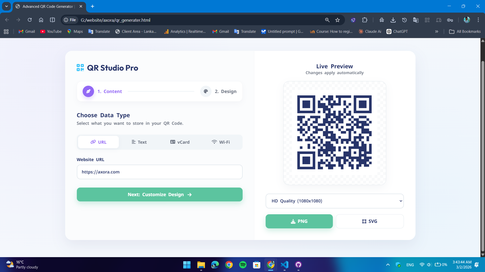
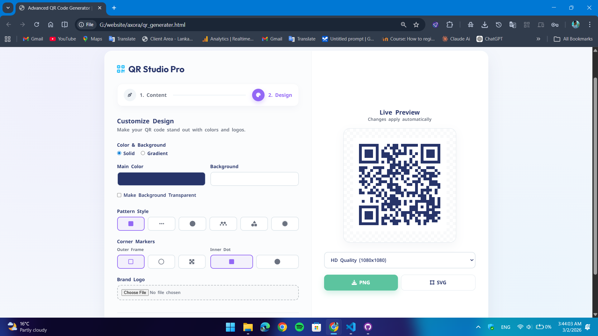
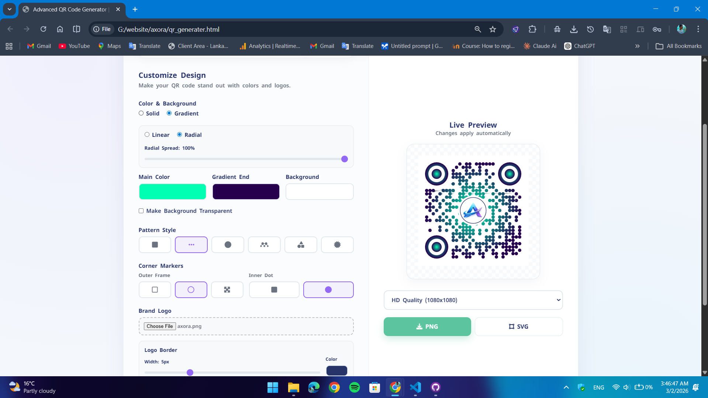

# 🚀 Axora - Advanced Pro QR Code Generator

This is a state-of-the-art QR code creation tool that goes beyond a typical QR Code generator and includes all the features needed by professional designers and businesses. It allows the user to create beautiful QR codes while watching the changes they make live (Real-time Preview).


---

## 📸 Screenshots








---

## ✨ Key Features

* 🔗 **Versatile Data Support:**
    * **URLs:** Optimized for websites and links.
    * **Plain Text:** Advanced formatting tools (Uppercase, Lowercase, Bullets).
    * **vCard:** Create digital business cards that save directly to contacts.
    * **Wi-Fi:** Instant connection QR codes with WPA/WEP and Hidden Network support.
* 🎨 **Advanced Styling & Gradients:**
    * Support for **Solid Colors** and **Linear/Radial Gradients**.
    * Customizable gradient angles and transparency settings.
* 🧩 **Custom Shapes & Geometry:**
    * Unique styles for QR Dots (Square, Rounded, Dots, etc.).
    * Customizable Corner Squares and Corner Dots for a distinct look.
* 🖼️ **Professional Logo Integration:**
    * Upload custom brand logos.
    * **Built-in Live Cropper:** Square or Circular cropping for perfect placement.
    * Customizable logo borders and background clearing.
* 💻 **Modern UI/UX:**
    * Sleek **Glassmorphism** design with smooth animations.
    * **Step-by-Step Wizard** interface for an intuitive workflow.
    * 100% Fully Responsive (Mobile, Tablet, Desktop).
* 📥 **High-Resolution Exports:**
    * Download in **PNG** or **SVG** (Vector) formats.
    * Selectable quality presets: **HD (1080p)**, **FHD (1920p)**, and **4K (3840p)** for high-quality printing.

## 🛠️ Built With

* **HTML5 & CSS3:** Custom UI components using Flexbox, CSS Grid, and Keyframe animations.
* **Vanilla JavaScript (ES6+):** Pure JS logic for high performance without heavy frameworks.
* **Key Libraries:**
    * [qr-code-styling](https://github.com/kozakurlat/qr-code-styling) - The core engine for high-quality QR generation.
    * [Cropper.js](https://github.com/fengyuanchen/cropperjs) - For real-time image cropping and manipulation.
    * [FontAwesome](https://fontawesome.com/) - Premium iconography.

## ⚙️ Installation & Usage

1.  **Clone the repository:**
    ```bash
    git clone https://github.com/ayeshmantha2002/QR-generator.git
    ```
2.  **Open the project:**
    Simply open `index.html` in any modern web browser. No local server or installation is required.

## 🚀 How to Create a Pro QR Code

1.  **Enter Content:** Choose your data type (URL, vCard, etc.) and input the information.
2.  **Customize Design:** Use the styling panel to adjust colors, gradients, and shapes.
3.  **Add Brand Logo:** Upload your logo, crop it using the built-in tool, and adjust the border.
4.  **Download:** Select your preferred resolution (up to 4K) and save your file.

## 📜 License

This project is licensed under the MIT License - see the [LICENSE](LICENSE) file for details.

---
Developed with ❤️ by Sameera Ayeshmantha.
